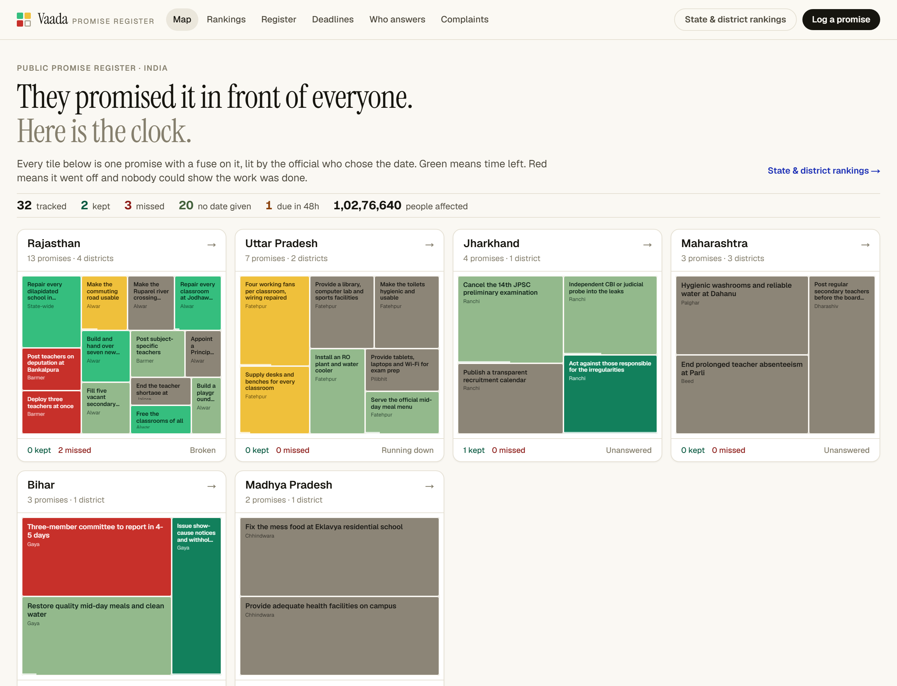
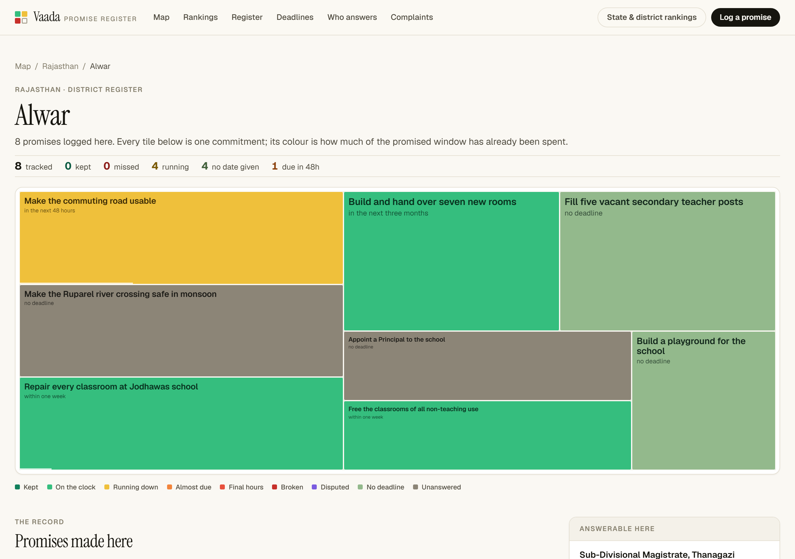
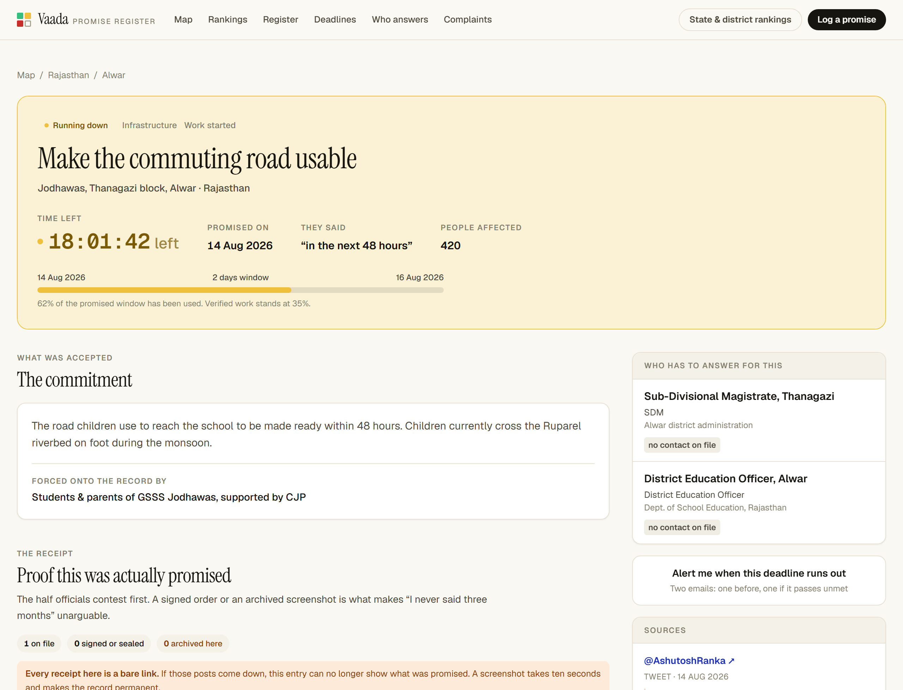
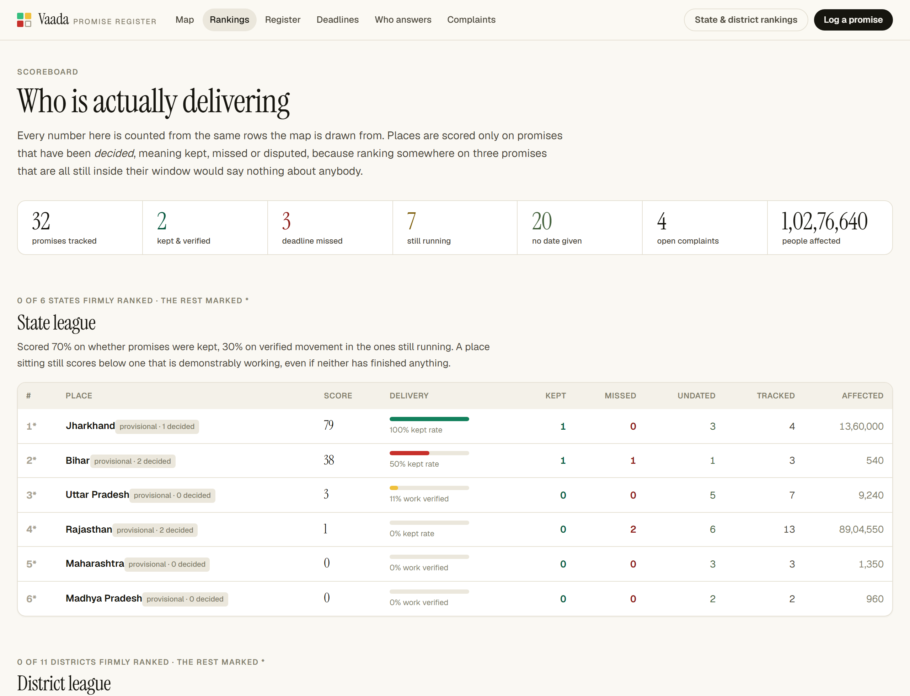
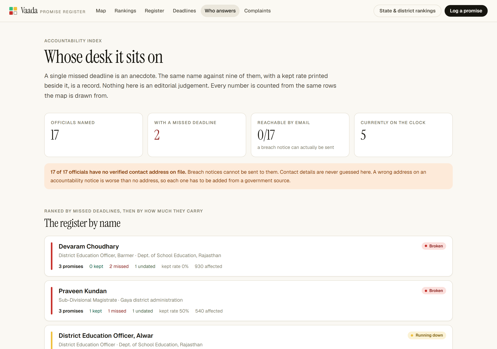
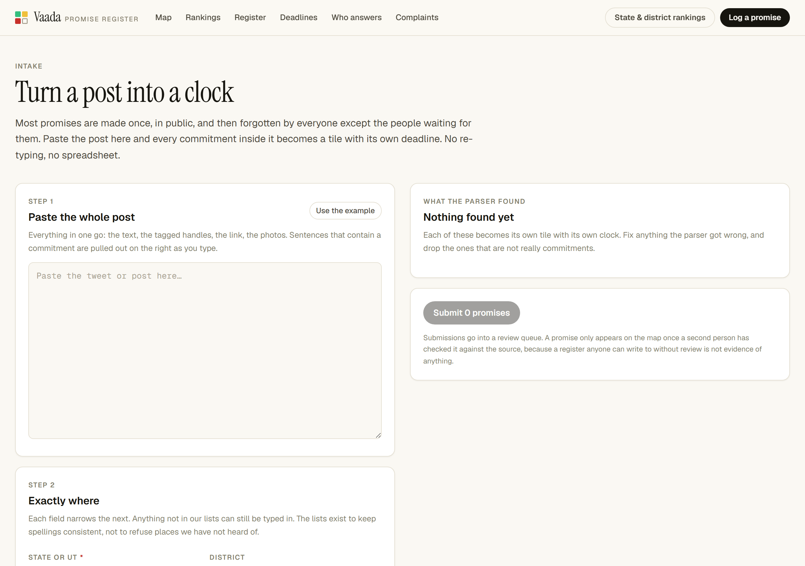
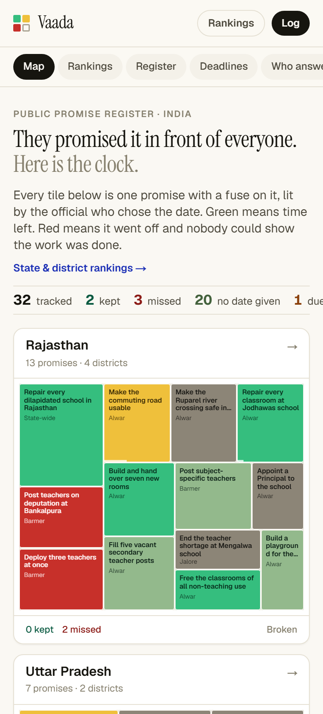

<div align="center">

# Vaada

**A public register of promises made by government officials, and whether they were kept.**

Every promise here was made out loud, in public, with a deadline the official
chose themselves. This site publishes the countdown.

[Method](#how-a-tile-gets-its-colour) · [Running it](#running-it) · [Hosting](DEPLOY.md) · [Contributing](CONTRIBUTING.md)

</div>

---



## What this is

In July and August 2026, school students across India walked out over
classrooms with no roofs, schools with no teachers, and toilets nobody could
use. In place after place they won commitments: repairs within a week, seven
rooms in three months, a road in 48 hours.

Then the cameras left, and there was no way to hold anyone to any of it.

Vaada is that missing piece. One row per commitment, one tile per row. Tiles
start green and slide through yellow and orange to red as the window the
official themselves named runs out. When a tile goes red, the deadline passed
and nobody could show the work was done.

It is deliberately dull machinery. The whole value is that it is checkable.

## What makes it different from a spreadsheet

**An undated promise is a finding, not missing data.** A promise with no
deadline can never be broken, which is exactly why it gets given. Those are
counted, coloured separately, and shown on the front page.

**Silence is a result.** Demands raised in public and met with no answer at all
stay on the register as `unanswered` rather than quietly disappearing.

**Progress moves on evidence, never on an announcement.** A bar only advances
when a volunteer accepts a photograph, a document, or a measurement. An official
saying the work is finished does not move it by itself.

**A red tile is a claim about evidence, not about a person.** The wording
throughout is "the deadline passed with no verified proof of completion". That
is what the register can actually show, and it is the line the whole project
depends on.

---

## The screens

### The map

One box per state, one tile per promise, sized by how many people it affects.
Everything that matters is on screen before you scroll.


### Drilling in

State → district → the individual promise. At district level the map goes full
width so the tiles are readable without hovering.



### One promise

A live countdown, the receipt proving it was promised, the evidence citizens
sent from the ground, an audit trail, and the named officials who owe an answer.



### Scoreboard

State and district league tables, delivery speed, and per-category kept rates.
Places are only scored on promises that have actually been decided.



### Who is answerable

Every official named on the register with the promises they own and their kept
rate. A jointly accepted promise counts against every name on it, so nobody can
point at the other.



### Logging a promise

Paste a post. Duration phrases like "within one week" and "in the next 48
hours" become real deadlines, named officials are picked out, and the location
narrows from state down to the individual school.



### On a phone



---

## How a tile gets its colour

Let *e* be the share of the promised window already spent.

| Condition | Band | Meaning |
| --- | --- | --- |
| `e < 0.55` | On the clock | Plenty of the window left |
| `0.55 ≤ e < 0.80` | Running down | More than half gone; ask for a status |
| `0.80 ≤ e < 0.95` | Almost due | The deadline is about to land |
| `e ≥ 0.95` | Final hours | Escalate now |
| past the deadline | **Broken** | Passed with no verified proof of completion |
| completed & verified | **Kept** | Done, and citizens confirmed it |
| no deadline ever given | No deadline | Accepted, but untrackable. Demand a date. |
| nobody responded | Unanswered | Raised in public, met with silence |

The colour tracks the window that was *agreed*, not how hard the job is. A
48-hour road promise therefore reddens about 45 times faster than a three-month
building promise, which is the correct behaviour: both parties agreed to those
terms.

Full rules are published on `/method` in the running app.

---

## Running it

```bash
npm install
npm run dev      # http://localhost:5300
```

It runs with **no configuration**. Without database credentials it serves the
founding register from `src/data/seed.ts` and validates submissions without
storing them, which is enough to develop against.

### With a database

1. Create a Supabase project.
2. Run `supabase/schema.sql` in the SQL editor.
3. Copy `.env.example` to `.env.local` and fill it in.
4. `npm run db:seed`

Deployment is covered in [DEPLOY.md](DEPLOY.md).

### Scripts

| Command | What it does |
| --- | --- |
| `npm run dev` | Dev server on port 5300 |
| `npm run build` | Production build |
| `npm run typecheck` | `tsc --noEmit` |
| `npm run lint` | ESLint |
| `npm run check:extract` | Sanity-check the deadline parser |
| `npm run db:seed` | Load the founding register into Supabase |
| `node scripts/screenshots.mjs` | Regenerate the images in this README |

---

## The founding register

32 commitments across Rajasthan, Uttar Pradesh, Bihar, Madhya Pradesh,
Maharashtra and Jharkhand, every one traceable to a published source, plus 10
receipts and 6 pieces of citizen evidence.

It includes a documented broken promise: an assurance given in Barmer on 25 July
2026 that went unfulfilled and triggered a second protest two days later. That
row exists because the register is only worth anything if it records the
failures as carefully as the wins.

---

## How it is built

Next.js 16, React 19, Tailwind v4, TypeScript, Supabase. No UI component
library; the design system is about 200 lines of CSS custom properties.

```
src/lib/
  types.ts        the domain model. Read this first.
  status.ts       bands, thresholds, rollups. Pure, and takes the clock as an argument.
  treemap.ts      squarified treemap (Bruls, Huizing & van Wijk)
  extract.ts      text to draft commitments: durations, named officials
  authority.ts    rolls promises up by the person who owns them
  scoreboard.ts   league tables, with sample-size guards
  alerts.ts       breach detection and notice composition. Cannot reach the network.
  ingest.ts       news source registry, feed parsing, candidate building
  geo.ts          India lookups; every level accepts free text
src/data/seed.ts       the founding register
src/components/        Mosaic, Countdown, PlacePicker, Receipts, the intake forms
src/app/api/cron/      the daily ingestion and deadline sweeps
supabase/schema.sql    tables, constraints, row-level security
```

### Two design decisions worth knowing

**The status engine never reads the clock itself.** `now` is passed in
everywhere. Server components read it once per request and thread it down;
client countdowns are seeded with the server's value so the first render matches
and hydration stays silent.

**Nothing the machine finds publishes itself.** The daily news sweep writes to a
review queue, never to the register. A pipeline that decides on its own that a
named minister promised something, and paints that on a public map, will
eventually be wrong about a real person, and one such row discredits every
correct row beside it.

---

## What is not built yet

Honest list, because a README that only describes the good parts is not much of
a record either:

- No accounts. `/review` is gated by a shared token, which is thin and says so.
- No one-click accept in the review queue; promotion is done in the database.
- Watcher confirmation emails are not sent, so double opt-in is incomplete.
- No official has a verified contact address, so every breach notice currently
  suppresses itself. That is correct behaviour, not a bug: addresses are never
  guessed.
- Sub-district and village coverage is limited to places already on the
  register. The LGD and UDISE import path is documented but unwritten.
- Seconding a complaint and corroborating a proof are not wired up.
- **No test suite.** `npm run check:extract` covers the deadline parser and
  nothing else.

---

## Contributing

The editorial standards matter more than the code style here. See
[CONTRIBUTING.md](CONTRIBUTING.md) for what counts as a promise, how sourcing
works, and the rules about naming individuals.

## Licence

[MIT](LICENSE) for the code.

The register content is compiled from published sources, each linked on its own
entry. It is offered for public accountability and journalism. If an entry about
you is wrong, file a complaint against it in the app and it will be checked
against its sources.
